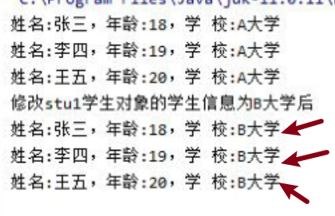
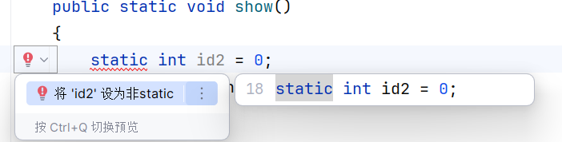

**1.共享作用：**属于类，不属于对象。


输出结果：




​	**2.调用方式**：推荐使用 `类名.成员` 调用。

​		若类中使用static方法/变量，那么不用定义一个变量在进行  ==.==  的调用，直接使用**==类.==**对应方法或者变量。


```Java
public class Test {
    public static void main(String[] args) {
        // 直接通过类名调用静态方法和变量
        Temp.show();
        System.out.println(Temp.id);
    }
}

class Temp {
    public static int id = 8;
    
    public Temp() {
        System.out.println("经过实例化对象成功调用了构造方法");
    }

    public static void show() {
        System.out.println("类直接调用静态方法");
    }
}
```


​	输出结果：


​	**3.限制**：Static 方法内不能访问非静态成员（因为非静态成员依赖对象存在）。

​				调用static的方法/变量必须也是static的方法。


​	**4.局部变量**：***==Static 无法修饰局部变量==***。




