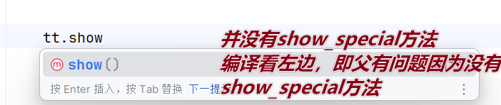

### 2.10 多态

#### 1.**核心口诀**：

```Java
Father f = new Son();
```

​		**向上转型：**

- ​	**成员变量**：***==编译看左边==*** (Father)，***==运行看左边==*** (Father)。(变量无多态性)

- ​	**成员方法**：***==编译看左边==*** (Father)，***==运行看右边==*** (Son)。(动态绑定)

​		**向下转型：**目的是将向上转型时丢失的子类特有方法找回。


```java
package Demo;
public class Test {
    public static void main(String[] args) {
        // 向上转型 (父类引用指向子类对象)
        TempFather tt = new TempSon();
        //对于成员变量   编译看左边 运行结果也看左边
        System.out.println("若输出是12    则a    是子， 10则是父");
        System.out.println(tt.a); // 输出 10
        //对于成员方法   编译看左边（父） ， 运行结果看右边（子）
        tt.show(); // 输出 子类的show方法

        /* 编译报错：父类没有 showSpecial 方法
           tt.showSpecial(); 
        */

        // 向下转型 (找回子类特有的方法)
        if (tt instanceof TempSon) {
            TempSon ttt = (TempSon) tt;
            ttt.showSpecial();
        }
    }
}

class TempFather {
    public int a = 10;
    public void show() {
        System.out.println("父类中的show方法");
    }
}

class TempSon extends TempFather {
    public int a = 12;
    @Override
    public void show() {
        System.out.println("子类的show方法");
    }
    public void showSpecial() {
        System.out.println("子类特有方法");
    }
}


```





#### 2.instanceof   


```java
// 定义Animal类
class Animal {
    public void shout(){
        System.out.println("动物叫……");
    }
}
......//省略定义Dog类，可参考4.4.3节中的案例一
// 定义测试类
public class Example17 {
    public static void main(String[] args) {

        Animal a1 = new Dog();
        // 通过向上转型实例化Animal对象

        System.out.println("Animal a1 = new Dog()：" + (a1 instanceof Animal));

        System.out.println("Animal a1 = new Dog()：" + (a1 instanceof Dog));

        Animal a2 = new Animal();
        // 实例化Animal对象

        System.out.println("Animal a2 = new Animal()：" + (a2 instanceof Animal));

        System.out.println("Animal a2 = new Animal()：" + (a2 instanceof Dog));
    }
}
```


输出：


```java
Animal a1 = new Dog():true
Animal a1 = new Dog():true
Animal a2 = new Animal():true
Animal a2 = new Animal():false
```

