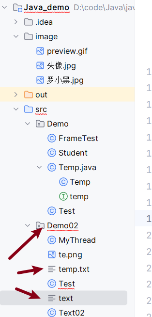

#### 1. 先读后写（对已创建好的文件复制）



```Java
package Demo02;


import org.w3c.dom.Text;

import java.io.*;

public class Test {
    public static void main(String[] args) throws Exception {
      /*    任务：
               字节流文件
      *         ·先读后写
      *         ·先写后读
      *
      * */
        FileInputStream fileInputStream = new FileInputStream("src/Demo02/text");
        //true : 如同C中的追加a（重新创建文件，若之前文件存在，保留之前内容，向后写入）的写入方式，默认false对用C中的w（重新创建文件，若之前文件存在，那么删除之前的内容）的写入方式
        FileOutputStream fileOutputStream = new FileOutputStream("src/Demo02/temp.txt",true);
        int len = 0;
        byte[] b = new byte[1024];
        try {
            while((len = fileInputStream.read(b))!=-1) {
                fileOutputStream.write(b,0,len);
            }
        }
        catch (Exception e) {

        }
        finally {
            if(fileOutputStream!=null)fileOutputStream.close();
            if(fileInputStream!=null)fileInputStream.close();
        }

    }
}
```

#### 2. 先写后读

```java
package Demo02;


import org.w3c.dom.Text;

import java.io.*;

public class Test {
    public static void main(String[] args) throws Exception {
      /*    任务：
               字节流文件
      *         ·先读后写
      *         ·先写后读
      *
      * */
        FileInputStream fileInputStream = new FileInputStream("src/Demo02/text");
        FileOutputStream fileOutputStream = new FileOutputStream("src/Demo02/text");


        byte[] b = {'a','b','b','c'};

        for (int i = 0; i < b.length; i++) {
            fileOutputStream.write(b[i]);
        }
        fileOutputStream.close();
        int size = fileInputStream.available();
        for(int i=0;i<size;i++)
        {
            System.out.println((char) fileInputStream.read());
        }
        fileInputStream.close();


    }
}
```

#### 3. 编译乱码问题


- 上面的程序首先创建文件test.txt，并把给定的数字以二进制形式写进该文件，同时输出到控制台上。

- 以上代码由于是二进制写入，可能存在乱码，你可以使用以下代码实例来解决乱码问题：


```java
import java.io.*;
public class fileStreamTest2 {
    public static void main(String[] args) throws IOException {
        // 1. 创建文件对象（指向a.txt）
        File f = new File("a.txt");
        // 2. 字节输出流：负责把数据写入文件（底层操作字节）
        FileOutputStream fop = new FileOutputStream(f);
        // 3. 字符输出流（包装字节流）：指定编码为UTF-8，把字符转成字节时用UTF-8规则
        OutputStreamWriter writer = new OutputStreamWriter(fop, "UTF-8");
        
        // 4. 写入内容：中文、换行、英文都能正确编码
        writer.append("Java编程很有趣！");
        writer.append("\r\n"); // 换行
        writer.append("English is easy to read.");
        
        // 5. 关闭字符输出流（会自动把缓冲区内容写入文件，同时释放资源）
        writer.close();
        // （注：原代码中“fop.close()”可省略，因为writer.close()会间接关闭fop）
        
        // 6. 字节输入流：负责从文件读取字节
        FileInputStream fip = new FileInputStream(f);
        // 7. 字符输入流（包装字节流）：指定编码为UTF-8，把字节转成字符时用UTF-8规则
        InputStreamReader reader = new InputStreamReader(fip, "UTF-8");
        
        // 8. 读取并拼接内容
        StringBuffer sb = new StringBuffer();
        while (reader.ready()) { // 判断是否还有可读字符
            sb.append((char) reader.read()); // 逐个字符读取并拼接
        }
        System.out.println(sb.toString()); // 输出读取的内容
        
        // 9. 关闭字符输入流（释放资源）
        reader.close();
        // （注：原代码中“fip.close()”可省略，因为reader.close()会间接关闭fip）
    }
}
```


#### 4. try-with-resources 与缓冲读写（文本按行读写模板）

- **try-with-resources（推荐写法）**：自动关闭资源（即使异常也会 close）

  ```java
  try (BufferedReader br = new BufferedReader(new FileReader("a.txt"))) {
      String line;
      while ((line = br.readLine()) != null) {
          System.out.println(line);
      }
  }
  ```

- **缓冲流（性能）**：`BufferedInputStream/BufferedOutputStream`、`BufferedReader/BufferedWriter`

