| 布局管理器    | 特点                                      | 典型场景                                 |
| ------------- | ----------------------------------------- | :--------------------------------------- |
| FlowLayout    | 组件按行从左到右，满了换行；支持对齐/间距 | 简单工具栏、按钮行                       |
| BorderLayout  | 东西南北中 5 区；Center 会被拉伸          | 主窗口常用：顶部菜单、左侧导航、中间主区 |
| GridLayout    | 均分网格，所有格子同大小                  | 计算器键盘、固定网格面板                 |
| GridBagLayout | “可变网格”最灵活；可控制权重、跨行跨列    | 复杂表单（Swing 里最强但最麻烦）         |
| BoxLayout     | 沿 X 或 Y 轴排列                          | 垂直/水平排列列表                        |
| CardLayout    | 多个面板“卡片切换”                        | 向导式界面/多页面切换                    |
| GroupLayout   | IDE 生成居多（对齐强）                    | NetBeans/IDEA GUI Designer               |
| FormLayout    | 表单布局（常见于 JGoodies）               | 表单、配置页（如果项目里用到再学）       |

本次实现下图的程序


#### 1.设置


首先先在Setting中找到GUI并按我的图中进行修改：

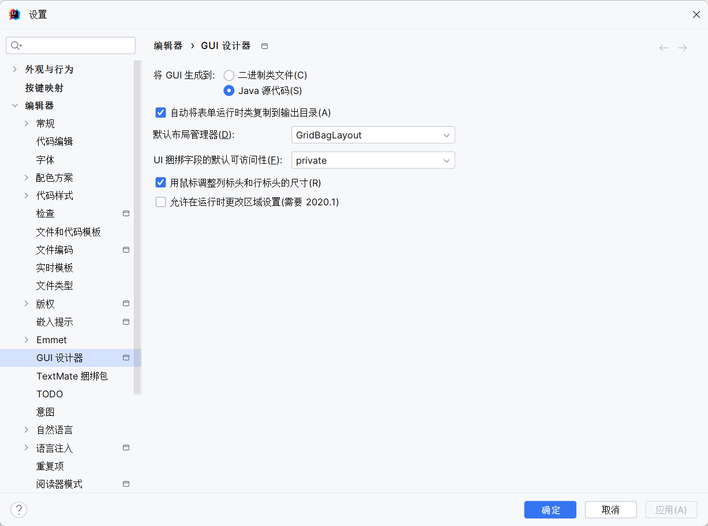

#### 2.使用

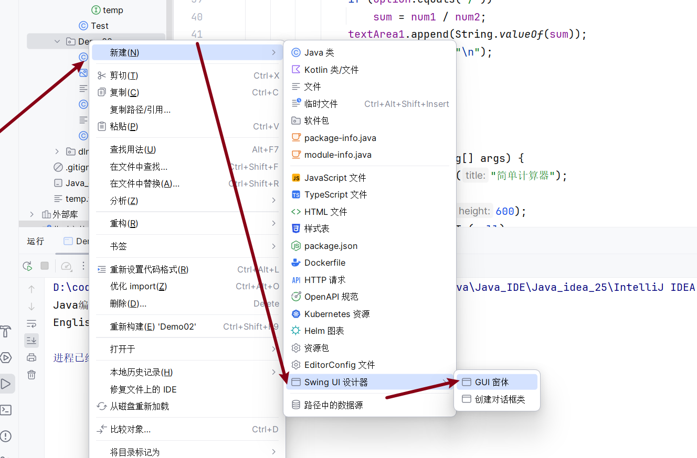


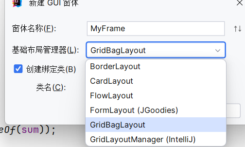

| rderLayout（边框布局）        | 将容器划分为 **北、南、东、西、中** 5 个固定区域，每个区域仅容纳 1 个组件。 | 南北区域水平拉伸，东西区域垂直拉伸，中心区域填充剩余空间；默认布局为`JFrame`内容窗格。 | 界面需明确区域划分的场景（如菜单栏 + 工具栏 + 主内容区 + 侧边栏的组合界面）。 |
| ----------------------------- | ------------------------------------------------------------ | ------------------------------------------------------------ | ------------------------------------------------------------ |
| CardLayout（卡片布局）        | 多个组件共享同一显示空间，同一时间仅 1 个组件可见（类似 “卡片切换”）。 | 通过`first()`/`last()`/`next()`<br />/`previous()`/`show()`切换可见组件。 | 多步骤界面（如安装向导、表单分步填写、标签页切换内容）。     |
| FlowLayout（流式布局）        | 组件按 **从左到右、从上到下** 顺序排列，空间不足时自动换行；默认对齐方式为居中。 | 支持左对齐（LEFT）、右对齐（RIGHT）、两端对齐（JUSTIFY），可通过构造函数指定对齐方式。 | 组件数量不确定或简单排列的场景（如工具栏按钮组、对话框底部的确认 / 取消按钮）。 |
| FormLayout（JGoodies）        | 基于 “行列网格” 的灵活布局，支持组件跨多行 / 多列，尺寸单位多样（像素、毫米等）。 | 需通过`ColumnSpec`/`RowSpec`定义行列规则，依赖`jgoodies-forms`库。 | 复杂表单界面（如带标签、输入框、下拉框的配置页面，需精确控制组件尺寸和间距）。 |
| GridBagLayout（网格包布局）   | 最灵活的网格布局，组件可占据任意数量的网格单元，通过`GridBagConstraints`精细控制。 | `gridx/gridy`（坐标）、`gridwidth/gridheight`（占据行列数）、`fill`（填充方式）等约束。 | 复杂且不规则的布局（如混合文本、按钮、列表、图片的综合界面）。 |
| GridLayoutManager（IntelliJ） | IntelliJ IDEA 自定义的简化网格布局，用于 IDE 的 GUI 可视化设计。 | 设计时自动生成网格布局代码，支持可视化调整行列大小和组件位置。 | 仅在 IntelliJ IDEA 中使用，适合快速搭建简单网格布局的界面（如规则排列的表单）。 |


**在这里我们使用GridBagLayout（推荐）**


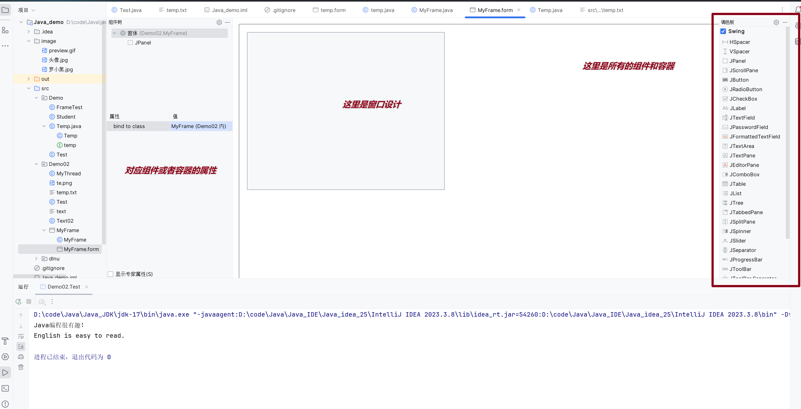


按照图中对组件进行拖拽，并对位置大小进行调整：

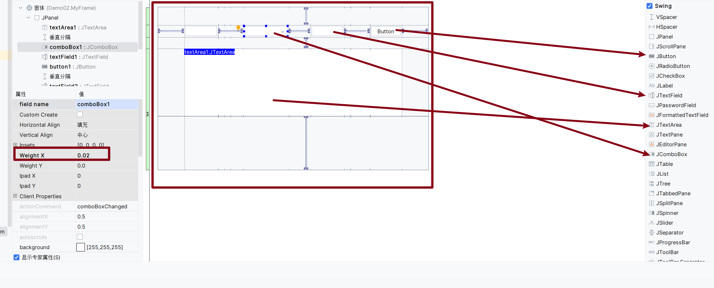

双击JComboBox和Button进行修改内容：

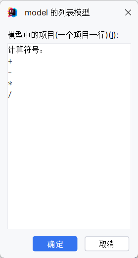

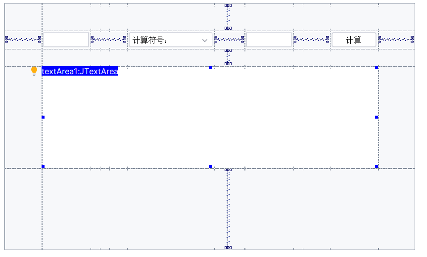

右击预览如图：

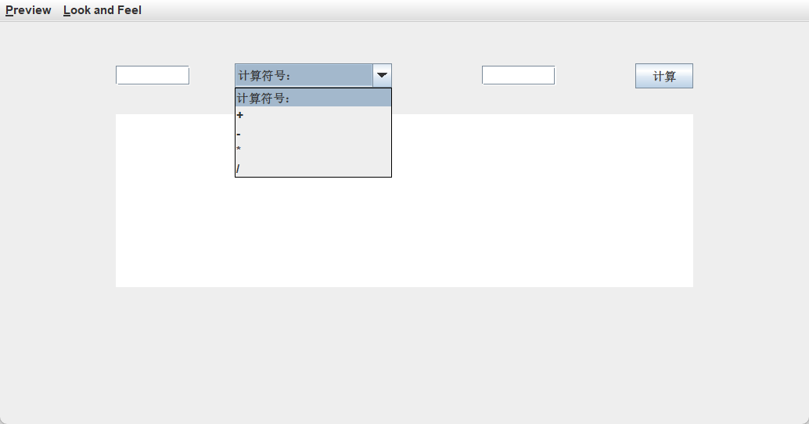

然后回到代码部分：

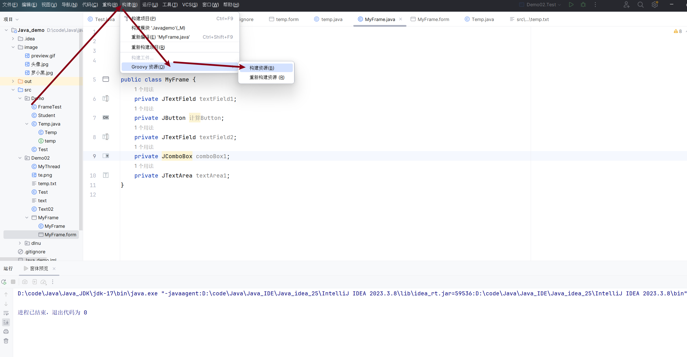

但是没有生成主函数，所以这里并没有运行：

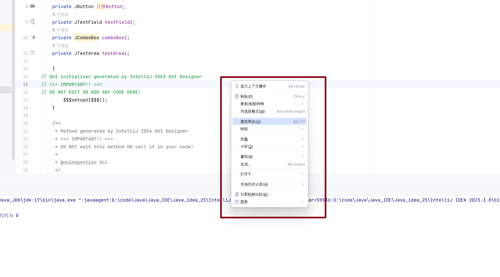

生成主函数，然后运行，若报错，可能是图中箭头所指值是空，按图添加就即可：

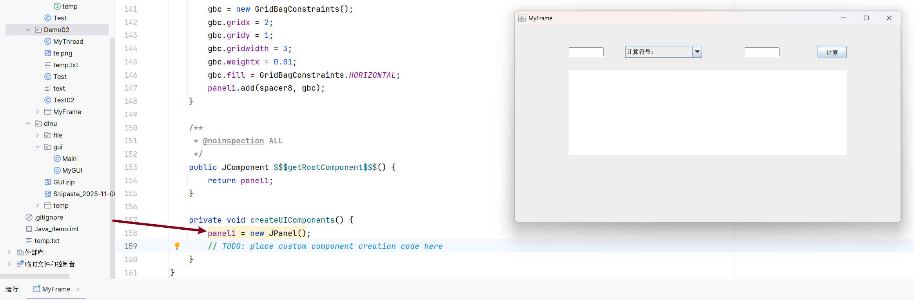

由于一打开窗口就是很小，并且位置是左上角，对代码需要修改：

```Java
public static void main(String[] args) {
    //对标题修改
    JFrame frame = new JFrame("简单计算器");
    frame.setContentPane(new MyFrame().panel1);
    frame.setDefaultCloseOperation(JFrame.EXIT_ON_CLOSE);
    //设置窗口大小
    frame.setSize(600,600);
    //  起始位置居中
    frame.setLocationRelativeTo(null);
    // 关闭此项，
    //frame.pack();
    frame.setVisible(true);
}
```

添加动作，由于要实现按下按钮进行计算，所以需要对按钮进行动作监听，回到设计界面：

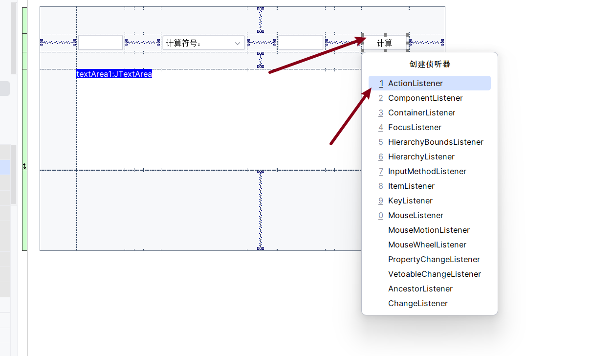


在代码：

```Java
public MyFrame() {
    计算Button.addActionListener(new ActionListener() {
        @Override
        public void actionPerformed(ActionEvent e) {
            String temp = null;
            flag = true;
            num1 = Double.valueOf(textField1.getText());
            num2 = Double.valueOf(textField2.getText());
            temp = String.valueOf(comboBox1.getSelectedItem());
            switch (temp) {
                case "+":
                    sum = num1 + num2;
                    break;
                case "-":
                    sum = num1 - num2;
                    break;
                case "*":
                    sum = num1 * num2;
                    break;
                case "/":
                    sum = num1 / num2;
                    break;
                default:
                    textArea1.append("错误运算，输入四则运算符号！\n");
                    flag = false;
                    break;
            }
            if (flag)
                textArea1.append(String.valueOf(sum) + "\n");
        }
    });
}
```

接下来运行正常如图：

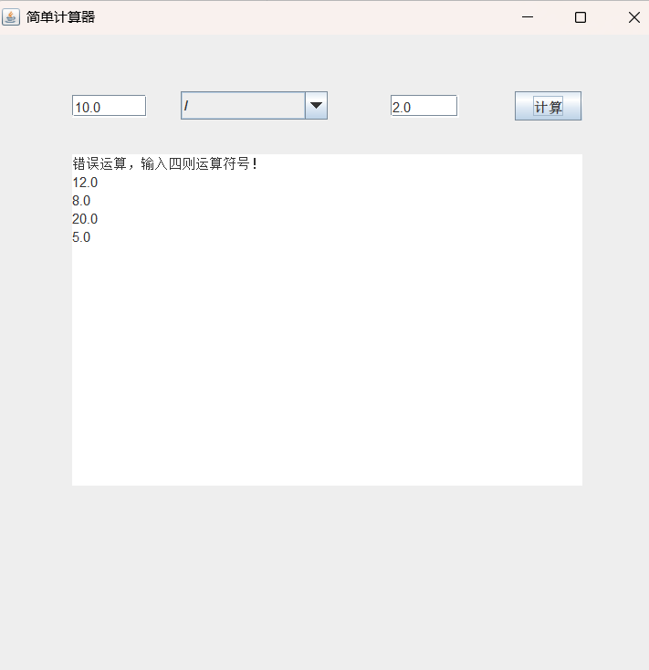

**补充：对于菜单JMenu、JMenu,对话框等需要自己编写，这里并没有。**


| `JMenuBar`  | 顶级菜单栏容器，用于承载多个`JMenu`。                        | 软件的全局导航（如 “文件 - 编辑 - 视图 - 帮助” 菜单，几乎所有桌面应用都需要）。 |
| ----------- | ------------------------------------------------------------ | ------------------------------------------------------------ |
| `JMenu`     | 单个菜单（如 “文件”“编辑”），可包含`JMenuItem`或子`JMenu`。  | 分组功能（如 “文件” 菜单下的 “新建、保存、退出” 操作）。     |
| `JMenuItem` | 菜单中的具体选项（如 “新建文件”“保存项目”）。                | 触发具体业务逻辑（点击 “退出” 关闭程序，点击 “保存” 存储数据）。 |
| `JDialog`   | 对话框容器，用于展示提示、确认、输入等临时界面（模态 / 非模态）。 | 操作确认（删除文件时的 “是否确认删除” 弹窗）、信息提示（登录成功提示）、表单输入（如 “新建用户” 弹窗）。 |


这里示例补充代码应用，以上题无关：

```Java
package Demo;

import javax.swing.*;
import javax.swing.event.AncestorEvent;
import javax.swing.event.AncestorListener;
import java.awt.*;
import java.awt.event.ActionEvent;
import java.awt.event.KeyEvent;
import java.awt.event.KeyListener;

public class FrameTest extends JFrame {
    public FrameTest()
    {
        InitFrame();


        InitMenu();

        Initimage();

        this.setVisible(true);

    }

    private void Initimage() {

        ImageIcon icon  = new ImageIcon("image\\头像.jpg");
        JLabel jLabel = new JLabel(icon);

        jLabel.setBounds(0,0,900,900);

        JButton jButton = new JButton("登录");
        JButton jButton2 = new JButton("注册");
        jButton.setBounds(400,400,100,100);
        jButton2.setBounds(600,600,100,100);
        /*jButton.addActionListener(e->{
                    System.out.println("登录成功");
                }


        );*/
        jButton.addKeyListener(new KeyListener() {

            public void keyTyped(KeyEvent e) {

            }


            public void keyPressed(KeyEvent e) {
                int code = e.getKeyCode();
                if(code == 65) System.out.println("你按下了登录的A");
                if(code == 66) System.out.println("你按下了登录的B");

            }


            public void keyReleased(KeyEvent e) {

            }
        });

        jButton2.addKeyListener(new KeyListener() {

            public void keyTyped(KeyEvent e) {

            }


            public void keyPressed(KeyEvent e) {
                int code = e.getKeyCode();
                if(code == 65) System.out.println("你按下了注册的A");
                if(code == 66) System.out.println("你按下了注册的B");

            }


            public void keyReleased(KeyEvent e) {

            }
        });


        this.getContentPane().add(jButton);
        this.getContentPane().add(jButton2);
        this.getContentPane().add(jLabel);
    }

    private void InitMenu() {
        JMenuBar Jmenubar = new JMenuBar();

        JMenu functionJmenu = new JMenu("功能");
        JMenu HelpJmenu = new JMenu("帮助");


        JMenuItem a = new JMenuItem("重启");
        JMenuItem b = new JMenuItem("开始");
        JMenuItem c = new JMenuItem("结束");


        JMenuItem d = new JMenuItem("帮助文档");


        a.addActionListener(e->{
            System.out.println("点击菜单中的重启");
            JDialog dialog = new JDialog();

            dialog.setSize(400,400);
            dialog.setLocationRelativeTo(null);

            dialog.setDefaultCloseOperation(JDialog.DISPOSE_ON_CLOSE);
            dialog.setLayout(null);

            dialog.setVisible(true);

            dialog.setTitle("二维码");
            JLabel label = new JLabel(new ImageIcon("image\\罗小黑.jpg"));
            label.setBounds(0,0,360,360);
            dialog.getContentPane().add(label);

        });


        functionJmenu.add(a);
        functionJmenu.add(b);
        functionJmenu.add(c);

        HelpJmenu.add(d);


        Jmenubar.add(functionJmenu);
        Jmenubar.add(HelpJmenu);

        this.setJMenuBar(Jmenubar);
    }

    private void InitFrame() {
        this.setSize(900,900);
        this.setDefaultCloseOperation(WindowConstants.EXIT_ON_CLOSE);
        this.setTitle("Hello World");
        this.setLocationRelativeTo(null);
        this.setLayout(null);
    }

}
```

